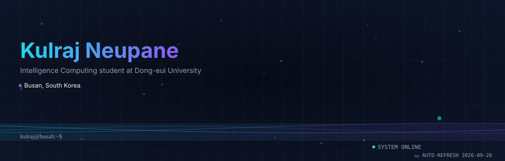
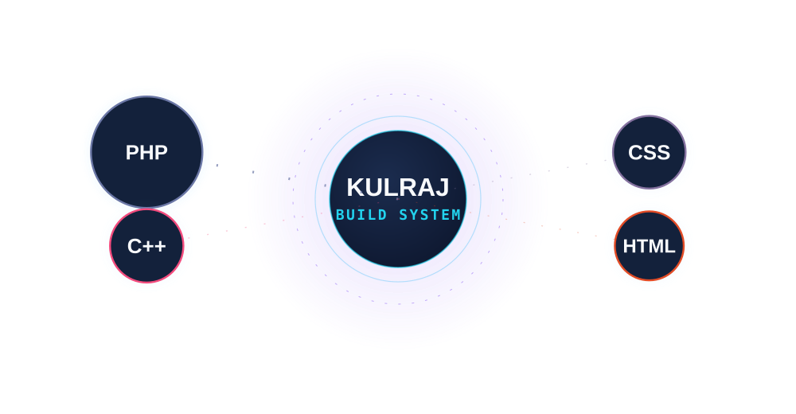
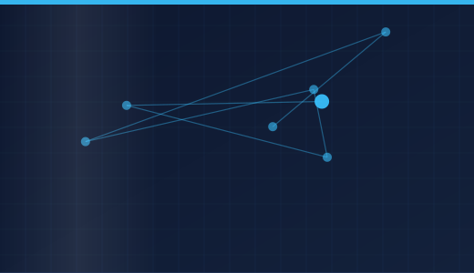
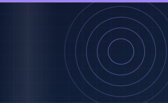
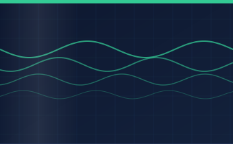
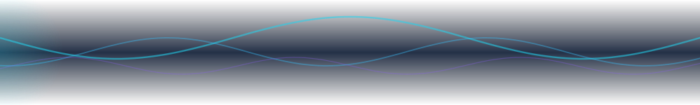
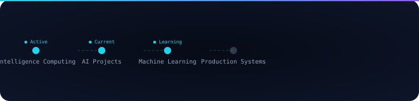
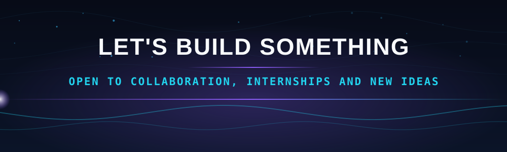

<!-- GENERATED:HERO:START -->

<!-- GENERATED:HERO:END -->

<!-- GENERATED:IDENTITY:START -->

01 &nbsp;/&nbsp; IDENTITY&nbsp;&nbsp;Verified from repository configuration
<table width="100%" cellspacing="0" cellpadding="0"><tr><td width="56%" valign="top" style="padding:0 24px 0 0;"><h2 style="margin:0 0 4px;font-family:-apple-system,BlinkMacSystemFont,'Segoe UI','Noto Sans',Helvetica,Arial,sans-serif;font-size:26px;font-weight:700;letter-spacing:-0.4px;color:#F8FAFC;line-height:1.25;">Student developer building with AI</h2>
From &quot;Hello World&quot; to the real world — I build useful digital experiences, experiment with AI, and turn ideas into working products.

B.Sc. (Hons) · Intelligence Computing · 3rd Year · 6th Semester
Dong-eui University · Currently Enrolled</td><td valign="top" style="padding:0;"><table width="100%" cellspacing="0" cellpadding="0"><tr><td style="padding:10px 18px 10px 0;border-bottom:1px solid #2A3C62;vertical-align:top;white-space:nowrap;width:1%;">STUDYING</td><td style="padding:10px 0;border-bottom:1px solid #2A3C62;vertical-align:top;">Intelligence Computing</td></tr><tr><td style="padding:10px 18px 10px 0;border-bottom:1px solid #2A3C62;vertical-align:top;white-space:nowrap;width:1%;">BUILDING</td><td style="padding:10px 0;border-bottom:1px solid #2A3C62;vertical-align:top;">AI projects and practical digital products</td></tr><tr><td style="padding:10px 18px 10px 0;border-bottom:1px solid #2A3C62;vertical-align:top;white-space:nowrap;width:1%;">LEARNING</td><td style="padding:10px 0;border-bottom:1px solid #2A3C62;vertical-align:top;">Machine learning</td></tr><tr><td style="padding:10px 18px 10px 0;border-bottom:1px solid #2A3C62;vertical-align:top;white-space:nowrap;width:1%;">BASED IN</td><td style="padding:10px 0;border-bottom:1px solid #2A3C62;vertical-align:top;">Busan, South Korea</td></tr></table></td></tr></table>
<a href="https://github.com/kulraj025" target="_blank" rel="noopener noreferrer" style="display:inline-block;margin:6px 8px 6px 0;padding:16px 28px;background:#22D3EE;color:#04121C;border:1px solid #22D3EE;border-radius:8px;font-family:ui-monospace,'SF Mono','Cascadia Code',Menlo,Consolas,'DejaVu Sans Mono',monospace;font-size:15px;font-weight:600;letter-spacing:1.2px;text-decoration:none;line-height:1.2;">VIEW GITHUB</a><a href="https://eng.deu.ac.kr/eng/index.do" target="_blank" rel="noopener noreferrer" style="display:inline-block;margin:6px 8px 6px 0;padding:16px 28px;background:transparent;color:#22D3EE;border:1px solid #2A3C62;border-radius:8px;font-family:ui-monospace,'SF Mono','Cascadia Code',Menlo,Consolas,'DejaVu Sans Mono',monospace;font-size:15px;font-weight:600;letter-spacing:1.2px;text-decoration:none;line-height:1.2;">UNIVERSITY</a><a href="mailto:Kulraj024@gmail.com" target="_blank" rel="noopener noreferrer" style="display:inline-block;margin:6px 8px 6px 0;padding:16px 28px;background:transparent;color:#22D3EE;border:1px solid #2A3C62;border-radius:8px;font-family:ui-monospace,'SF Mono','Cascadia Code',Menlo,Consolas,'DejaVu Sans Mono',monospace;font-size:15px;font-weight:600;letter-spacing:1.2px;text-decoration:none;line-height:1.2;">EMAIL ME</a>

<!-- GENERATED:IDENTITY:END -->

<!-- GENERATED:TECHNOLOGY:START -->

02 &nbsp;/&nbsp; TECHNOLOGY&nbsp;&nbsp;Detected from public repositories

Detected from public repositories — the languages actually present in public code, listed with their real share of public bytes. The four largest are drawn in the orbit above.
<table width="100%" cellspacing="0" cellpadding="0"><tr><td style="padding:6px 14px 6px 0;white-space:nowrap;width:1%;"></td><td style="padding:6px 12px 6px 0;font-family:-apple-system,BlinkMacSystemFont,'Segoe UI','Noto Sans',Helvetica,Arial,sans-serif;font-size:16px;font-weight:600;color:#F8FAFC;white-space:nowrap;">PHP</td><td style="padding:6px 12px 6px 0;width:100%;"></td><td style="padding:6px 0 6px 14px;font-family:ui-monospace,'SF Mono','Cascadia Code',Menlo,Consolas,'DejaVu Sans Mono',monospace;font-size:12px;color:#94A3B8;text-align:right;white-space:nowrap;">69.6%</td></tr><tr><td style="padding:6px 14px 6px 0;white-space:nowrap;width:1%;"></td><td style="padding:6px 12px 6px 0;font-family:-apple-system,BlinkMacSystemFont,'Segoe UI','Noto Sans',Helvetica,Arial,sans-serif;font-size:16px;font-weight:600;color:#F8FAFC;white-space:nowrap;">C++</td><td style="padding:6px 12px 6px 0;width:100%;"></td><td style="padding:6px 0 6px 14px;font-family:ui-monospace,'SF Mono','Cascadia Code',Menlo,Consolas,'DejaVu Sans Mono',monospace;font-size:12px;color:#94A3B8;text-align:right;white-space:nowrap;">11.3%</td></tr><tr><td style="padding:6px 14px 6px 0;white-space:nowrap;width:1%;"></td><td style="padding:6px 12px 6px 0;font-family:-apple-system,BlinkMacSystemFont,'Segoe UI','Noto Sans',Helvetica,Arial,sans-serif;font-size:16px;font-weight:600;color:#F8FAFC;white-space:nowrap;">CSS</td><td style="padding:6px 12px 6px 0;width:100%;"></td><td style="padding:6px 0 6px 14px;font-family:ui-monospace,'SF Mono','Cascadia Code',Menlo,Consolas,'DejaVu Sans Mono',monospace;font-size:12px;color:#94A3B8;text-align:right;white-space:nowrap;">10.6%</td></tr><tr><td style="padding:6px 14px 6px 0;white-space:nowrap;width:1%;"></td><td style="padding:6px 12px 6px 0;font-family:-apple-system,BlinkMacSystemFont,'Segoe UI','Noto Sans',Helvetica,Arial,sans-serif;font-size:16px;font-weight:600;color:#F8FAFC;white-space:nowrap;">HTML</td><td style="padding:6px 12px 6px 0;width:100%;"></td><td style="padding:6px 0 6px 14px;font-family:ui-monospace,'SF Mono','Cascadia Code',Menlo,Consolas,'DejaVu Sans Mono',monospace;font-size:12px;color:#94A3B8;text-align:right;white-space:nowrap;">7.7%</td></tr><tr><td style="padding:6px 14px 6px 0;white-space:nowrap;width:1%;"></td><td style="padding:6px 12px 6px 0;font-family:-apple-system,BlinkMacSystemFont,'Segoe UI','Noto Sans',Helvetica,Arial,sans-serif;font-size:16px;font-weight:600;color:#F8FAFC;white-space:nowrap;">JavaScript</td><td style="padding:6px 12px 6px 0;width:100%;"></td><td style="padding:6px 0 6px 14px;font-family:ui-monospace,'SF Mono','Cascadia Code',Menlo,Consolas,'DejaVu Sans Mono',monospace;font-size:12px;color:#94A3B8;text-align:right;white-space:nowrap;">0.8%</td></tr></table>

<!-- GENERATED:TECHNOLOGY:END -->

<!-- GENERATED:PROJECTS:START -->

03 &nbsp;/&nbsp; FEATURED WORK&nbsp;&nbsp;Selected from public repositories
<table width="100%" cellspacing="0" cellpadding="0"><tr><td width="44%" valign="middle" style="padding:0 20px 0 0;"></td><td valign="middle" style="padding:0;">
campus_connect_x_v2

Campus Connect is a student-focused web platform built with HTML, PHP, JavaScript, and MySQL to improve campus communication and engagement. It provides announcements, event updates, student interaction, and campus services in one place with a simple and responsive design.

PHP

★ 0⑂ 0updated 2026-06-08

<a href="https://github.com/kulraj025/campus_connect_x_v2" target="_blank" rel="noopener noreferrer" style="display:inline-block;margin:6px 8px 6px 0;padding:16px 28px;background:#22D3EE;color:#04121C;border:1px solid #22D3EE;border-radius:8px;font-family:ui-monospace,'SF Mono','Cascadia Code',Menlo,Consolas,'DejaVu Sans Mono',monospace;font-size:15px;font-weight:600;letter-spacing:1.2px;text-decoration:none;line-height:1.2;">REPOSITORY</a><a href="https://kulraj025.github.io/campus_connect_x_v2/" target="_blank" rel="noopener noreferrer" style="display:inline-block;margin:6px 8px 6px 0;padding:16px 28px;background:transparent;color:#22D3EE;border:1px solid #2A3C62;border-radius:8px;font-family:ui-monospace,'SF Mono','Cascadia Code',Menlo,Consolas,'DejaVu Sans Mono',monospace;font-size:15px;font-weight:600;letter-spacing:1.2px;text-decoration:none;line-height:1.2;">LIVE DEMO</a>
</td></tr></table>

<table width="100%" cellspacing="0" cellpadding="0"><tr><td width="50%" valign="top" style="padding:0 14px 0 0;"><table width="100%" cellspacing="0" cellpadding="0"><tr><td width="38%" valign="middle" style="padding:0 20px 0 0;"></td><td valign="middle" style="padding:0;">
Initial-Portfolio-Website-

Personal portfolio that reflects myself

HTML

★ 0⑂ 0updated 2026-05-22

<a href="https://github.com/kulraj025/Initial-Portfolio-Website-" target="_blank" rel="noopener noreferrer" style="display:inline-block;margin:6px 8px 6px 0;padding:16px 28px;background:transparent;color:#22D3EE;border:1px solid #2A3C62;border-radius:8px;font-family:ui-monospace,'SF Mono','Cascadia Code',Menlo,Consolas,'DejaVu Sans Mono',monospace;font-size:15px;font-weight:600;letter-spacing:1.2px;text-decoration:none;line-height:1.2;">REPOSITORY</a><a href="https://kulraj025.github.io/Initial-Portfolio-Website-/" target="_blank" rel="noopener noreferrer" style="display:inline-block;margin:6px 8px 6px 0;padding:16px 28px;background:transparent;color:#22D3EE;border:1px solid #2A3C62;border-radius:8px;font-family:ui-monospace,'SF Mono','Cascadia Code',Menlo,Consolas,'DejaVu Sans Mono',monospace;font-size:15px;font-weight:600;letter-spacing:1.2px;text-decoration:none;line-height:1.2;">LIVE DEMO</a>
</td></tr></table></td><td width="50%" valign="top" style="padding:0 14px 0 0;"><table width="100%" cellspacing="0" cellpadding="0"><tr><td width="38%" valign="middle" style="padding:0 20px 0 0;"></td><td valign="middle" style="padding:0;">
Dynamic-Cv

Dynamic resume using php and mysql database

PHP

★ 1⑂ 0updated 2025-12-09

<a href="https://github.com/kulraj025/Dynamic-Cv" target="_blank" rel="noopener noreferrer" style="display:inline-block;margin:6px 8px 6px 0;padding:16px 28px;background:transparent;color:#22D3EE;border:1px solid #2A3C62;border-radius:8px;font-family:ui-monospace,'SF Mono','Cascadia Code',Menlo,Consolas,'DejaVu Sans Mono',monospace;font-size:15px;font-weight:600;letter-spacing:1.2px;text-decoration:none;line-height:1.2;">REPOSITORY</a><a href="https://kulraj025.github.io/Dynamic-Cv/" target="_blank" rel="noopener noreferrer" style="display:inline-block;margin:6px 8px 6px 0;padding:16px 28px;background:transparent;color:#22D3EE;border:1px solid #2A3C62;border-radius:8px;font-family:ui-monospace,'SF Mono','Cascadia Code',Menlo,Consolas,'DejaVu Sans Mono',monospace;font-size:15px;font-weight:600;letter-spacing:1.2px;text-decoration:none;line-height:1.2;">LIVE DEMO</a>
</td></tr></table></td></tr></table>

More work

<a href="https://github.com/kulraj025/OOPs_your_Balance" target="_blank" rel="noopener noreferrer" style="display:inline-block;margin:6px 16px 6px 0;font-family:ui-monospace,'SF Mono','Cascadia Code',Menlo,Consolas,'DejaVu Sans Mono',monospace;font-size:14px;color:#22D3EE;text-decoration:none;border-bottom:1px solid #2A3C62;padding-bottom:2px;">OOPs_your_Balance</a><a href="https://github.com/kulraj025/Bankingmanagementsys" target="_blank" rel="noopener noreferrer" style="display:inline-block;margin:6px 16px 6px 0;font-family:ui-monospace,'SF Mono','Cascadia Code',Menlo,Consolas,'DejaVu Sans Mono',monospace;font-size:14px;color:#22D3EE;text-decoration:none;border-bottom:1px solid #2A3C62;padding-bottom:2px;">Bankingmanagementsys</a>

<!-- GENERATED:PROJECTS:END -->

<!-- GENERATED:ACTIVITY:START -->

04 &nbsp;/&nbsp; ACTIVITY & LEARNING&nbsp;&nbsp;Live from the GitHub API
<table width="100%" cellspacing="0" cellpadding="0"><tr><td width="25%" valign="top" style="padding:0 12px 0 0;">
REPOSITORIES

10
</td><td width="25%" valign="top" style="padding:0 12px 0 0;">
FOLLOWERS

1
</td><td width="25%" valign="top" style="padding:0 12px 0 0;">
STARS

2
</td><td width="25%" valign="top" style="padding:0 12px 0 0;">
FORKS

0
</td></tr></table>
MOST DETECTED LANGUAGEPHP

<!-- GENERATED:ACTIVITY:END -->

<!-- GENERATED:CONTACT:START -->

05 &nbsp;/&nbsp; CONTACT&nbsp;&nbsp;Busan, South Korea

<a href="mailto:Kulraj024@gmail.com" target="_blank" rel="noopener noreferrer" style="display:inline-block;margin:6px 8px 6px 0;padding:16px 28px;background:#22D3EE;color:#04121C;border:1px solid #22D3EE;border-radius:8px;font-family:ui-monospace,'SF Mono','Cascadia Code',Menlo,Consolas,'DejaVu Sans Mono',monospace;font-size:15px;font-weight:600;letter-spacing:1.2px;text-decoration:none;line-height:1.2;">EMAIL ME</a><a href="https://github.com/kulraj025" target="_blank" rel="noopener noreferrer" style="display:inline-block;margin:6px 8px 6px 0;padding:16px 28px;background:transparent;color:#22D3EE;border:1px solid #2A3C62;border-radius:8px;font-family:ui-monospace,'SF Mono','Cascadia Code',Menlo,Consolas,'DejaVu Sans Mono',monospace;font-size:15px;font-weight:600;letter-spacing:1.2px;text-decoration:none;line-height:1.2;">GITHUB</a><a href="https://eng.deu.ac.kr/eng/index.do" target="_blank" rel="noopener noreferrer" style="display:inline-block;margin:6px 8px 6px 0;padding:16px 28px;background:transparent;color:#22D3EE;border:1px solid #2A3C62;border-radius:8px;font-family:ui-monospace,'SF Mono','Cascadia Code',Menlo,Consolas,'DejaVu Sans Mono',monospace;font-size:15px;font-weight:600;letter-spacing:1.2px;text-decoration:none;line-height:1.2;">UNIVERSITY</a>

KULRAJ / DIGITAL HORIZON · LIVE GITHUB DATA · REFRESHED 2026-09-26

<!-- GENERATED:CONTACT:END -->
