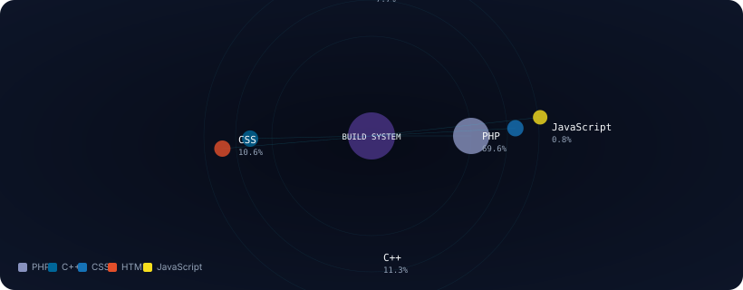
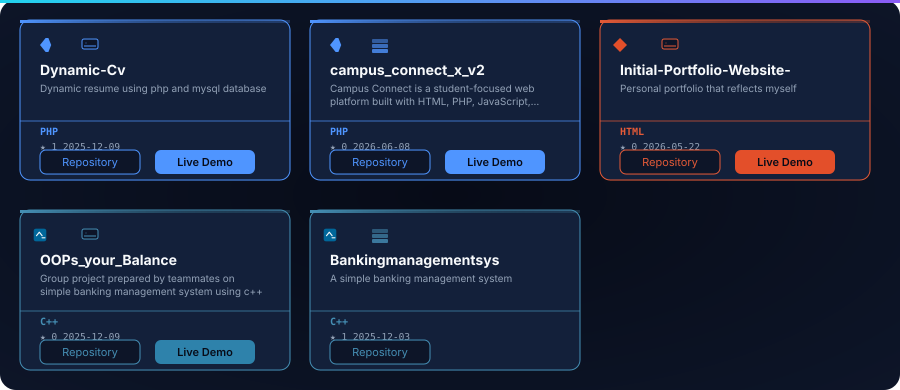
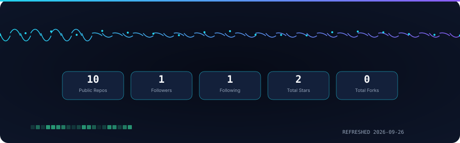
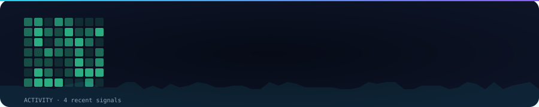

<!-- GENERATED:HERO:START -->

<!-- GENERATED:HERO:END -->

---

<!-- GENERATED:IDENTITY:START -->

<strong style='color:#F8FAFC'>Kulraj Neupane</strong> · Busan, South Korea · Dong-eui University · B.Sc. (Hons) · Intelligence Computing · 3rd Year · 6th Semester

<!-- GENERATED:IDENTITY:END -->

---

<!-- GENERATED:TECHNOLOGY:START -->

<!-- GENERATED:TECHNOLOGY:END -->

---

<!-- GENERATED:PROJECTS:START -->

<!-- GENERATED:PROJECTS:END -->

---

<!-- GENERATED:ACTIVITY:START -->

<!-- GENERATED:ACTIVITY:END -->

---

<!-- GENERATED:LEARNING:START -->

<!-- GENERATED:LEARNING:END -->

---

<!-- GENERATED:CONTACT:START -->

<a href="mailto:Kulraj024@gmail.com" target="_blank" rel="noopener noreferrer" style="color:#22D3EE;font-family:SF Mono,monospace;font-size:12px;text-decoration:none;border:1px solid #22D3EE44;border-radius:999px;padding:6px 14px;display:inline-block;margin:4px;">Email</a><a href="https://github.com/kulraj025" target="_blank" rel="noopener noreferrer" style="color:#22D3EE;font-family:SF Mono,monospace;font-size:12px;text-decoration:none;border:1px solid #22D3EE44;border-radius:999px;padding:6px 14px;display:inline-block;margin:4px;">GitHub</a><a href="https://eng.deu.ac.kr/eng/index.do" target="_blank" rel="noopener noreferrer" style="color:#8B5CF6;font-family:SF Mono,monospace;font-size:12px;text-decoration:none;border:1px solid #8B5CF644;border-radius:999px;padding:6px 14px;display:inline-block;margin:4px;">Dong-eui University</a>

<!-- GENERATED:CONTACT:END -->

---

<!-- GENERATED:FOOTER:START -->

• LIVE DATA • REFRESHED 2026-09-26 •

Busan Digital Horizon · Auto-generated profile

<!-- GENERATED:FOOTER:END -->
